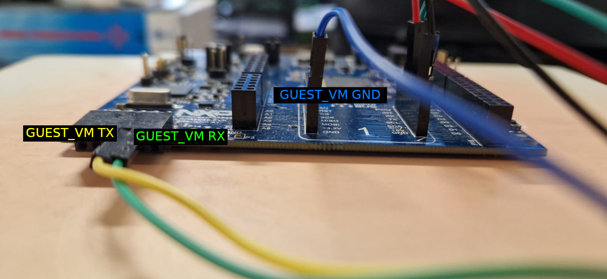

# UC1.1 Manifest

This repository contains instructions on how to build and run a Proof of Concept
(PoC) Trusted Service for secure PUF Authentication based on the ZK-PUF scheme.

## Requirements

- `python3-venv`
- `make`
- `LinkServer`
- `arm-none-eabi-objdump`
- `lua`
- (optional) `tio` **v3.8**


## All-in-one

To install dependencies, build everything, and flash the image to the board in
one command:

> Important: Ensure the LPCxpresso55S69 board is connected via the P6 Debug Link
  port before running this command, as both enrollment and flashing steps
  require an active connection.

```sh
make all
```

## Building

### Prerequisites

After cloning the repository, initialize the virtual machines (VMs), the
enrollment app, and the hypervisor submodules:

```sh
git clone https://github.com/crosscon/UC1.1-Manifest.git
cd UC1.1-Manifest
git submodule update --init --recursive
```

To not install `west` utility requirements globally using a python virtual
environment is suggested. This can be overriden by passing `USE_VENV=0` to
`make`.

```sh
python3 -m venv .venv
source .venv/bin/activate
```

To install python dependencies and Zephyr SDK run:

```sh
make install-deps
```

And to fetch required code for all zephyr targets run:

```sh
make update
```

### Enrolling

The PUF implementation for the LPCxpresso55S69 requires two non-secret values to
reconstruct the PUF response:
- Activation Code
- Key Code

For this reason a [Enrollment App](./ENROLLMENT_APP) has been created. It
extracts these values and prints them over a serial connection, after which they
are saved and transformed into binaries for use in the final PUF_VM image.

> Important: For this step connect the LPCxpresso55S69 board to your host
  machine using a USB cable through the P6 Debug Link port.

```sh
make enroll
```

Two scripts are provided within this step that are chosen based on users environment and input:
- [`capture_enroll.lua`](./scripts/capture_enroll.lua)
  - Automatically captures output and creates neccessary files.
- [`fallback_capture_enroll.lua`](./scripts/fallback_capture_enroll.lua)
  - Requires manual parsing of the serial output from the enrollment app.

#### Expected Output

```sh
(...)
Activation code hex saved to /tmp/activation_code.hex
Activation code bin saved to /tmp/activation_code.bin
Intrinsic key hex saved to /tmp/intrinsic_key.hex
Intrinsic key bin saved to /tmp/intrinsic_key.bin
renamed '/tmp/activation_code.bin' -> '/home/user/UC1.1-Manifest/build/enrollment_data/activation_code.bin'
renamed '/tmp/activation_code.hex' -> '/home/user/UC1.1-Manifest/build/enrollment_data/activation_code.hex'
renamed '/tmp/intrinsic_key.bin' -> '/home/user/UC1.1-Manifest/build/enrollment_data/intrinsic_key.bin'
renamed '/tmp/intrinsic_key.hex' -> '/home/user/UC1.1-Manifest/build/enrollment_data/intrinsic_key.hex'
Output moved to build/enrollment_data/
```

Enrollment must be performed **once per device**. The resulting binaries will be
reused in all future builds. Re-enrolling the device will make all previous
$COM$ values obsolete as PUF response will differ thus authentication won't be
possible with previously used data.

### Building

To build all components, apply the enrollment data and align VM start-points
within hypervisor:

```sh
make build
```

### Cleaning

To clean build output simply run:

```sh
make clean
```

## Flashing

Connect the LPCxpresso55S69 board to your host machine using a USB cable through
the P6 Debug Link port. Currently the script works only with the `LinkServer`
utility. Then simply run:

```sh
make flash
```

## Running

`GUEST_VM` occupies flexcomm 3/UART 3 while `PUF_VM` occupies flexcomm 2/UART 2.

- UART 2
    - `RX` - `P1_24`
    - `TX` - `P0_27`
- UART 3
    - `RX` - `P0_3`
    - `TX` - `P0_2`

### Pictures




## License

See LICENSE file.

## Acknowledgments

The work presented in this repository is part of the
[CROSSCON project](https://crosscon.eu/) that received funding from the European
Union’s Horizon Europe research and innovation programme under grant agreement
No 101070537.

<p align="center">
    
</p>

<p align="center">
    
</p>
