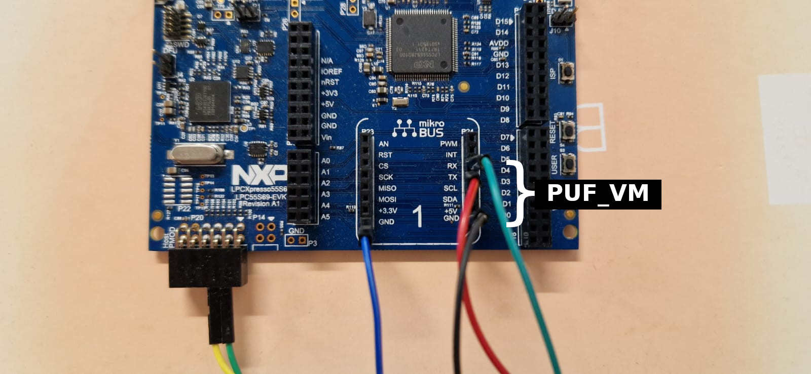

# UC1.1 Manifest

This repository contains instructions how to build and run a PoC Trusted Service
for secure PUF Authentication based on ZK-PUF Scheme.

## Requirements

- `python3-venv`
- `make`
- `LinkServer`

## Building

After cloning the repository one has to initialize the VM's and hypervisor as
they're git submodules.

```sh
git clone https://github.com/crosscon/UC1.1-Manifest.git
cd UC1.1-Manifest
git submodule update --init --recursive
```
To not install `west` utility requirements globally using a python virtual
environment is suggested. This can be overriden by passing `USE_VENV=0` to
`make`.

```sh
python3 -m venv .venv
source .venv/bin/activate
```

To install all dependancies and build images one can simply run:

```sh
make all
```

## Flashing

Connect the LPCxpresso55S69 board to your host machine.
Currently the script works only with the `LinkServer` utility. Then simply run:

```sh
make flash
```

## Running

`GUEST_VM` occupies flexcomm 3/UART 3 while `PUF_VM` occupies flexcomm 2/UART 2.

- UART 2
    - `RX` - `P1_24`
    - `TX` - `P0_27`
- UART 3
    - `RX` - `P0_3`
    - `TX` - `P0_2`

### Pictures




## License

See LICENSE file.

## Acknowledgments

The work presented in this repository is part of the
[CROSSCON project](https://crosscon.eu/) that received funding from the European
Union’s Horizon Europe research and innovation programme under grant agreement
No 101070537.

<p align="center">
    
</p>

<p align="center">
    
</p>
